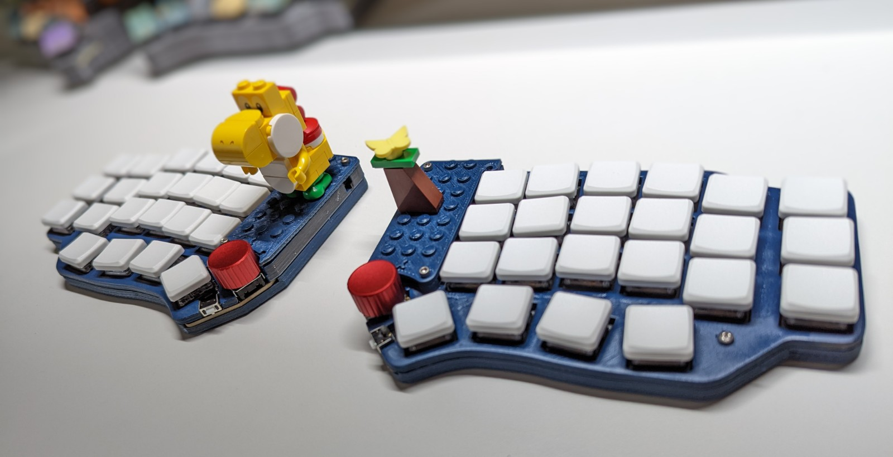

# xobdox

xobdox is a 40%(~ish) split wireless keyboard with a single PCB
design for both halves, featuring joystick, side button, encoder and
configurability options, powered by [ZMK](zmk.dev).

## Features
* Reversible PCB for both left and right halves
* 44/46/48 total switches/buttons
    * 44 mechanical switches, Cherry MX or Kailh low profile compatible, hot swappable
    * 2 optional side push buttons (one on each side)
    * 2 optional encoder push-down buttons (ENC2 only)
* PS2 style joystick
    * Used for mouse cursor movement emulation
    * Or as a joystick input device
* Flexible configurations
    * Choose to install either an encoder or a joystick on each side
    * Encoder can be installed at ENC1 or ENC2, joystick uses ENC2 only
    * 1u or 1.25u key caps on *some* keys

Other features are quite common in all the other DIY keyboards you can find out
there:
* Wireless (BLE) or Wired (USB) transport
* Ortho-linear (slightly modified and angled) layout
* Hot swappable switches
* Main power switch

No RGB/Glow/Backlight/Display support (yet).

## Gallery
* Some [keyboards](docs/gallery.md) I have built
* [Video](https://youtu.be/KlP1d-ixVQw) on joystick mouse movement emulation
* [Configuration](docs/configuration.md) options

## Battery life
Estimated battery life (in months)

|Battery capacity |Central(Left) side |Peripheral(Right) side |
|-----------------|-------------------|---------------|
|400mAh           | 1.3               | 4.8           |
|500mAh           | 1.5               | 5.7           |
|1000mAh          | 3.1               | 8.5           |
|2000mAh          | 5.1               | 11.3          |

## BOM
*Note* Qty is for one board/side, for a complete set of keyboard multiply Qty by
2 accordingly

|Qty|Device                      |Parts          |
|---|----------------------------|---------------|
|22 |Switch Socket1   |S1-S22         |
|22 |Switch1          |S1-S22         |
|1  |MJTP1117                    |S23            |
|24 |DKS14                       |D1-D24         |
|1  |EC12E24403012    |ENC1/ENC2      |
|1  |THB001P                     |JOYSTICK       |
|1  |1825232-1                   |SW1            |
|1  |seeeduino_xiao_ble          |U1             |
|1  |PKCELL LP5025353 |Battery        |

1 Compitable with Cherry MX or Kailh low profile sockets/switches
2 Use EC12 for low profile encoder, or EC11 for standard profile encoder
3 Depends on battery configuration options, different part can be chosen
