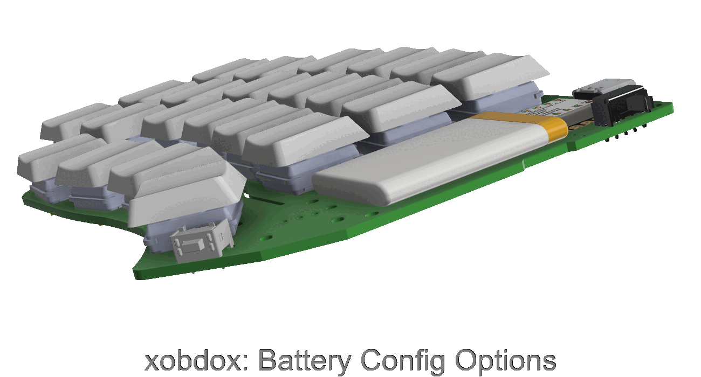
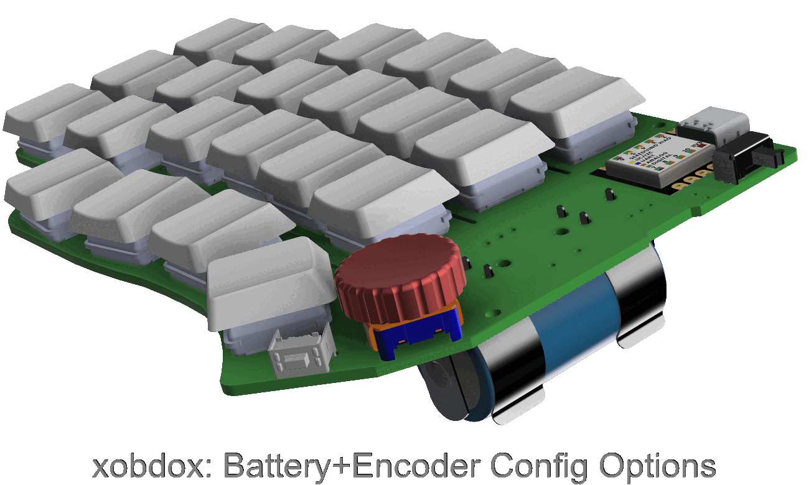
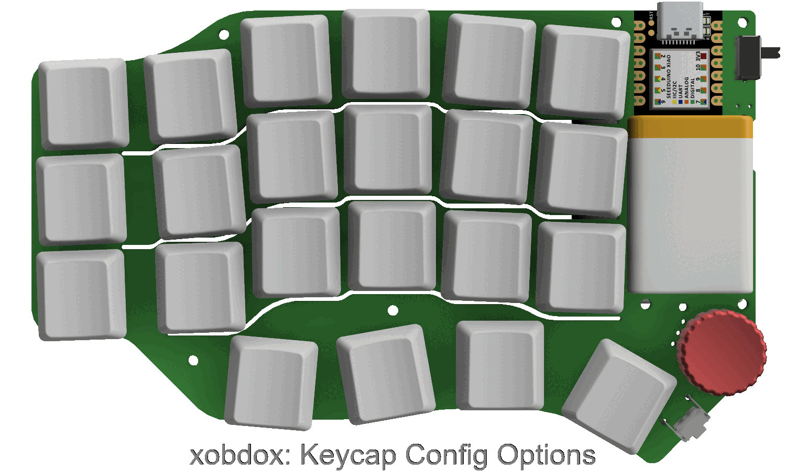

# xobdox
xobdox is a 40%(~ish) split wireless keyboard with a single PCB
design for both halves, featuring side buttons, encoders and configurable
battery options, swappable low profile switches, and powered by ZMK firmware.

## Features
* Reversible PCB for left and right halves
* 44/46/48 total switches
    * 44 mechanical switches
    * 2 optional side push button (one on each side by the thumb)
    * 2 optional encoder switch (if encoder installed at ENC2 location)
* Flexible configurations
    * 2 encoder locations
    * Top mount lipo battery or bottom mount 18350
    * 1u or 1.25u key caps on *some* keys

Other features are quite common in all the other DIY keyboards you can find out
there:
* Wireless (BLE) or Wired (USB)
* Ortho-linear (slightly modified) layout
* Hot swappable low profile switches (may add standard MX compatible switch support in the
  next rev)
* Encoders
* Power switch

Sorry, no RGB/Glow/Backlight/Display support (yet).

## Config Options
### Encoder
One of two locations can be used to install an encoder, though not both of them
can be used at the same time since they share the same GPIO pins.
ENC1 supports installing a knob up to 16mm diameter and ENC2 up to 25mm
respectively.
ENC2 also supports encoders with push button (e.g. EC11)

### Battery
Battery could be mounted on either side of the board.

If mounted on top, an idea size would be 25mm * 35mm * 50mm, such as a 502535 cell
[here](https://www.sparkfun.com/products/13851)

If mounted on bottom, an alternative form factor of 18350 can be used, which also
dubbed as the keyboard tilt support

### Encoder + Battery
Since there are location conflict between some of the encoder and battery
options, not all combinations of encoder and battery configs are feasible. This
gif shows all feasible ones

### Key caps
Some key caps can use 1.25u/1.5u key caps in addition to the standard 1u size. Those
are located on the edge columns and the last row.
The following gif demonstrated some possible key caps configurations (not
exhaustive)

*Note1*: 1.5u option only available to the switches on the most right/left column
on row 2 and row 3.

*Note2*: not all key caps on the last row can be 1.25u, specifically, there shall
not be any consecutive 1.25u key caps.

## Battery life
Estimated battery life (in months)

|Battery capacity |Central(Left) side |Peripheral(Right) side |
|-----------------|-------------------|---------------|
|400mAh           | 1.3               | 4.8           |
|500mAh           | 1.5               | 5.7           |
|1000mAh          | 3.1               | 8.5           |
|2000mAh          | 5.1               | 11.3          |

## BOM
*Note* Qty is for one board/side, for a complete set of keyboard multiply Qty by
2 accordingly

|Qty|Device            |Parts          |
|---|------------------|---------------|
|22 |Kailh Choc Socket |S1-S22         |
|22 |Kailh Choc Switch |S1-S22         |
|1  |MJTP1117          |S23            |
|24 |DKS14             |D1-D24         |
|1  |EC12E2440301\*    |ENC1/ENC2      |
|1  |1825232-1         |SW1            |
|1  |seeeduino_xiao_ble|U1             |
|1  |PKCELL LP502535\* |Battery        |

\* Depends on configuration options, different part can be chosen.
