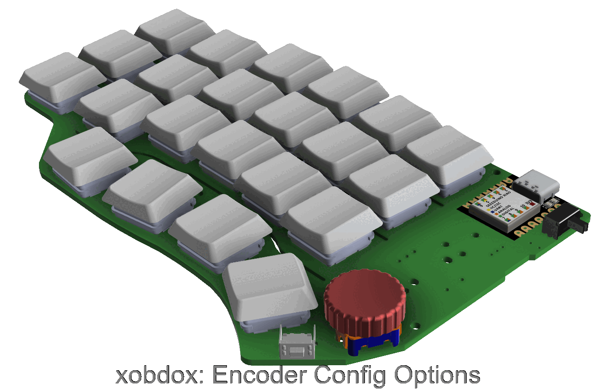

## Config Options
### Encoder
One of two locations can be used to install an encoder, though not both of them
can be used at the same time since they share the same GPIO pins.
ENC1 supports installing a knob up to 16mm diameter and ENC2 up to 25mm
respectively.
ENC2 also supports encoders with push button (e.g. EC11)

### Battery
Battery could be mounted on either side of the board.

If mounted on top, an idea size would be 25mm * 35mm * 50mm, such as a 502535 cell
[here](https://www.sparkfun.com/products/13851)

If mounted on bottom, an alternative form factor of 18350 can be used, which also
dubbed as the keyboard tilt support

### Encoder + Battery
Since there are location conflict between some of the encoder and battery
options, not all combinations of encoder and battery configs are feasible. This
gif shows all feasible ones

### Key caps
Some key caps can use 1.25u/1.5u key caps in addition to the standard 1u size. Those
are located on the edge columns and the last row.
The following gif demonstrated some possible key caps configurations (not
exhaustive)

*Note1*: 1.5u option only available to the switches on the most right/left column
on row 2 and row 3.

*Note2*: not all key caps on the last row can be 1.25u, specifically, there shall
not be any consecutive 1.25u key caps.

